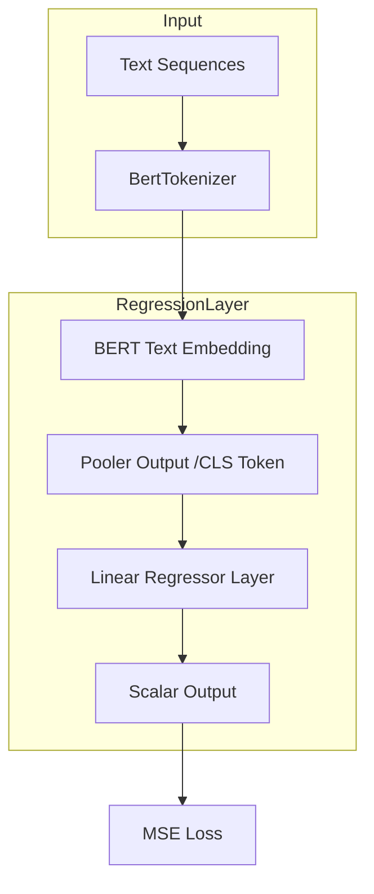

# BERT-Valence-Arousal-Prediction
This repository contains a PyTorch implementation of a BERT-based Regression Model. The architecture utilizes a pre-trained BERT to perform sequence-level regression tasks, mapping text inputs to continuous numerical values for Valence.

## 🚀 Model Architecture
The RegressionLayer class extends BertPreTrainedModel, adding to it a custom linear regression head.

